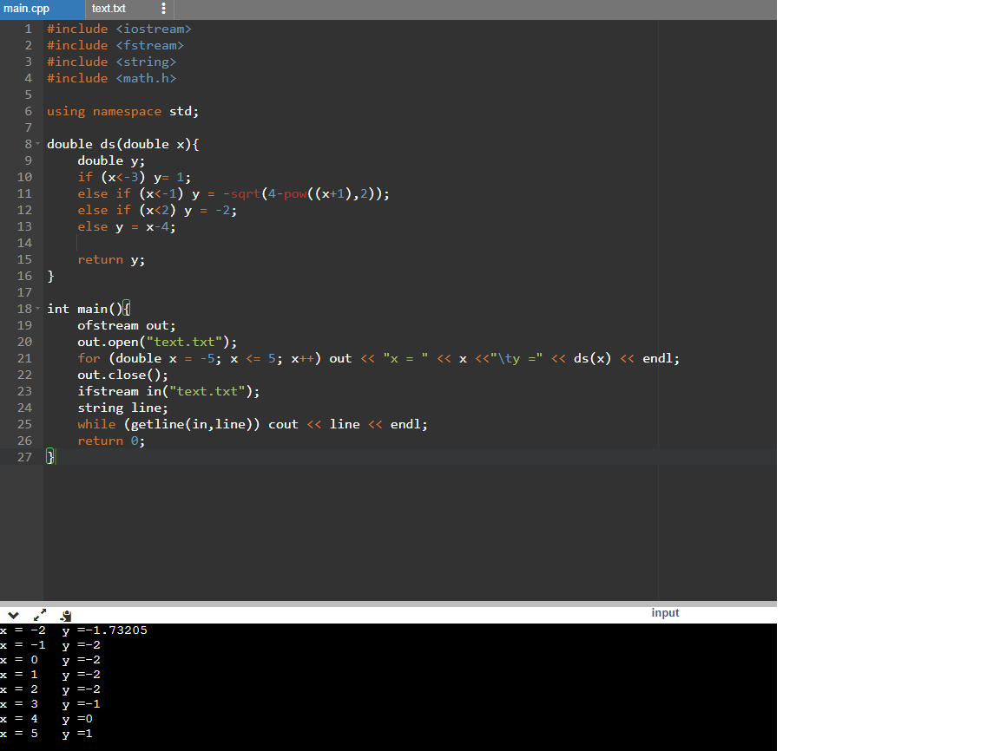

# Лабораторная работа 2
## В данной лабораторной работе необходимо создать 2 программы. Первая, расположенная в файле lab1, Получаент из текстового файла text.txt два значения, перемножает их и записывает в файл text2.txt Вторая программа, расположенная в файле 2, используя функцию из первой лабораторной работы записывает все точки в текстовый файл text.txt, после чего выводит их в консоль)

## код первой программы

## код второй программы

